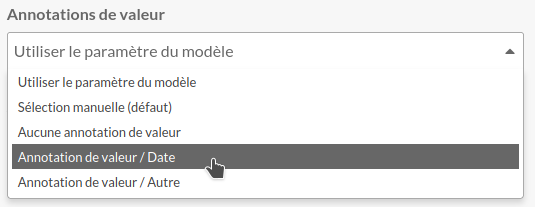
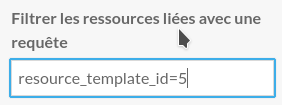
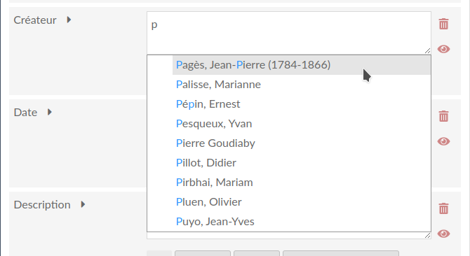
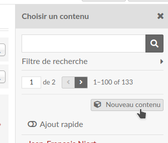

Advanced Resource Template (module for Omeka S)
===============================================

> __New versions of this module and support for Omeka S version 3.0 and above
> are available on [GitLab], which seems to respect users and privacy better
> than the previous repository.__

Voir le [Lisez-moi] en français.

[Advanced Resource Template] is a module for [Omeka S] that adds new settings to
the resource templates in order to simplify and to improve the edition of
resources. If you do not see images, go to the [original repository]:

- Specify templates to be used for each resource (items, media, item sets) and
  value annotations:

  

- Specify a template for a value annotation globally:

  

- Specify a template for a value annotation by property:

  

- Require a resource class from a limited list of resource classes:

  

- Limit template to a closed list of properties:

  

- Input control via a pattern:

  Force a literal value to follow a regex pattern, for example for identifiers.

  

- Minimum/maximum length of a literal value

- Minimum/maximum number of values:

  It allows to force to have only one value when needed, for example a main
  category or a publication date, or to limit the values to a specific number.

- Default value:

  This option simplifies creation of resources manually.

- Automatic value (on save):

  This option allows to add a value to the resource. It can be a raw string or a
  value created with placeholders and other values. By construction, this value
  cannot be removed. See below for more details.

  This value can be a simple string (to store a literal), or a json, formatted
  as the omeka api, to pass a value with a specific type:

  ```json
  {
    "type": "resource:item",
    "value_resource_id": 1
  }
  ```

  The value can be a string formatted with the inline format, for example
  `1 ^^resource:item`.

- Automatic value issued

  This option allows to add the first time the resource is made public and to
  store this date in a property, generally dcterms:issued.

- Display fake value:

  This option allows to display a fake value in a record when there is no value
  in a property. For example, for a resource "Photography", you may want to
  display "[Unknown photographer]" when the creator in undefined. This value is
  not stored in the resource and is not available in the api.

- Locked values:

  This option is useful for identifiers. Note that an automatic value is always
  a locked value, so this option is designed for other values. A locked value
  can still be updated by the api.

- Explode a value with a separator:

  This option allows to let the user filling multiple values in one field, then
  the values are exploded on save. For example, the property "dcterms:subject"
  can use the ";" as separator, so when the user fills "alpha; beta", it will be
  exploded into two values "alpha" and "beta".

- Filter linked resources with a query:

  For properties filled with an internal resource, the right sidebar searches in
  all resources by default. The option allows to limit them with a query to find
  them quickly. The query is the arguments of an standard advanced search request.

  

- Auto-completion with existing values:

  

- Other parameters:

  An option is added to add new parameters to the property. It does nothing by
  default, but can be used to pass informations about template properties to
  complex themes. There is no format for the parameters for now, since they
  should be managed by the theme or a specific module. It is recommended to use
  keys values pairs separated by "=" or json.

- Multiple fields with the same property:

  This option allows to have multiple times the same property with different
  settings. For example, you may want to have a free subject and a subject from
  two thesaurus. They can be set as different data types of the same property,
  but as multple template properties too, so each one has its own label and
  settings (size, number, etc.), as for spatial cover ("couverture spatiale") in
  the example below.

  **Warning**: for compatibility with core and modules and because they are
  variants of the same property, the template properties are kept gathered
  according to the original term in the resource template. So, in the example
  below, it is not possible to include another template property between the two
  spatial covers.

  

- Group properties under a label:

  When values and properties are numerous, the module allows to group them under
  a label. For example, you can group the Dublin Core properties like that:

```
  # Descriptive metadata
  dcterms:title
  dcterms:description
  dcterms:type
  dcterms:source
  dcterms:relation

  # Indexing metadata
  dcterms:coverage
  dcterms:subject

  # Intellectual property metadata
  dcterms:creator
  dcterms:contributor
  dcterms:publisher
  dcterms:rights

  # Instantiation metadata
  dcterms:date
  dcterms:format
  dcterms:identifier
  dcterms:language
```

  Here, the record is divided under four group labels.
  When some properties have multiple fields, you can group them more precisely
  appending the property label after a `/`, for example : `dcterms:subject/Sujets Rameau`
  and `dcterms:subject/Sujets libres`.

  

- Display of links on values of properties

  

  In the record, the value of the properties can be displayed as a search link,
  that is useful in particular to bounce on the subjects. The links to the
  linked resource or to the external uri can be added too. The properties can be
  selected via a whitelist and a blacklist.

- Language selection and default by template and by property, or no language:

  

- Order of linked resources (subject values)

  Warning: The fix [Omeka/Omeka-S#2054] is required for Omeka S v4.0.

  By default, linked resources are ordered by title. This option allows to order
  them with another property or multiple other properties. For example, the
  interventions of a manifestation published in a journal can be ordered by
  `bibo:volume` and `bibo:issue`. So, if each intervention references the
  manifestation via `dcterms:isPartOf`, the parameter of the template
  Manifestation can be:

```
  # dcterms:isPartOf
  bibo:volume asc
  bibo:issue asc
```

  The default order can be set with `#` without property, but the use cases
  are probably very rare.

- Minimum number of media

  It is possible to require a minimum number of media for an item. The option
  can be set by media template (use 0 for other templates). Here, a media
  with a template named "File" and another media are required:

```
  File = 1
  0 = 1
```

- Module Custom Vocab: Open authority list to allow user to add a new term when
  none can be used for a value.

  

- Module Value Suggest: keep original label

- Module Value Suggest: require uri

- Creation of a new linked resource during edition of a resource:

  This is useful to create a new author of a resource when authors are managed
  as resources. An option allows to allow it or to forbid it for each property.
  After creation, the new resource is automatically linked to the resource being
  edited.

  

- Selection of default data types:

  

- Autofill multiple fields with external data ([IdRef], and [Geonames] and generic
  json or xml services):

  See below.

- Import and export of templates as spreadsheet (csv/tsv):

  

- Dynamic Item Sets: Automatic attachment of items to item sets

  The feature allowing to create dynamic item sets was moved to a new module
  [Dynamic Item Sets] since version 3.4.38.

  When a query is set in the tab Advanced of the item set form, all existing and
  new items will be automatically attached to this item set, according to the
  request.

  Attention : items that are manually attached to the item set will be
  automatically detached if they are not in the results of the request.

  

- Resource block with selected properties

  This block allows to manage a short record in the page resource/show, for
  example when a theme displays a tab with "Record" and "Advanced metadata".

  The option is set in site settings. Each line is the term and the optional
  alternatif label, separated with a "=". To group properties, a class and an
  optional label may be added with "# div-class = Title". Example:

```
  # values-type
  dcterms:type

  # values-creator
  dcterms:creator

  # values-date
  dcterms:date
  dcterms:created
  dcterms:issued

  # values-subject
  dcterms:subject

  # values-rights = Terms of use
  dcterms:rights
  dcterms:license
```


Installation
------------

See general end user documentation for [installing a module].

This module requires the module [Common], that should be installed first.

The module uses an external library, so use the release zip to install it, or
use and init the source.

* From the zip

Download the last release [AdvancedResourceTemplate.zip] from the list of releases
(the master does not contain the dependency), and uncompress it in the `modules` directory.

* From the source and for development

If the module was installed from the source, rename the name of the folder of
the module to `AdvancedResourceTemplate`, go to the root module, and run:

```sh
composer install --no-dev
```


Usage
-----

Simply update your resource templates with the new options and use them in the
resource forms.

Here are some details for some features.

### Default value

By default, simply set the string to use a default value. For a resource, this
is the resource id and for uri this is the uri.

For a uri with a label, just separate the uri and the label with a space:

```
https://example.com/my-id Label of the value
```

For other data types that may be more complex, the default value can be set as a
json with all hidden sub-data that are in the Omeka resource form.

For a uri with a label and a language (for value suggest):

```json
{
    "@id": "https://example.com/my-id",
    "o:label": "Label of the value",
    "@value": "Value of the value (let empty)",
    "@language": "eng"
}
```

For a linked resource, that is useful only for a better display:

```json
{
    "display_title": "Title of my object",
    "value_resource_id": "1",
    "value_resource_name": "items",
    "url": "/admin/item/1",
}
```

### Automatic value

This option can be set at template level or template property level. The aim is
the same, but when created, the property level displays the input in the form.

#### Property level

The value specified in the field will be appended to the resource.

The value may be a simple string or a json representation of a value (like in
the api). The type of the value should be the one specified in the data types of
the template property. A check is done for validity, for example the id should
exists when the data type is a resource.

Some basic placeholders can be used with json dot notation and basic twig-like
commands. The format is the same than the auto-filling (see below). A future
release will integrate the improvements made for the module [Bulk Import].

#### Template level

Unlike property level, multiple values can be set, one by line.

For templates, the property should be specified too, and eventually other data
(language, visibility).

For example, to define the template and an automatic identifier for a media when
saving an item:

```
~ = o:resource_template = 1
~ = dcterms:identifier ^^literal {o:item.dcterms:creator.0..@value}_{o:item.o:template.o:label}_{{ index() }}
```

### Autofilling

For the autofilling, you have to set the mappings inside the main settings, then
to select it inside the resource template.

The mapping is a simple text specifying the services and the mappings. it uses
a similar format than the modules [Bulk Export], [Bulk Import], and [Bulk Import Files].
It will be improved with the [Bulk Import] format in a future release.

#### Integrated services

For example, if the service returns an xml Marc like for [Colbert], the mapping
can be a list of XPath and properties with some arguments (here with the
specialized ontology [bio] to manage biographic metadata):

```
[idref:person] = IdRef Person
/record/controlfield[@tag="003"] = bibo:uri ^^uri
/record/datafield[@tag="900"]/subfield[@code="a"] = dcterms:title
/record/datafield[@tag="200"]/subfield[@code="a"] = foaf:familyName
/record/datafield[@tag="200"]/subfield[@code="b"] = foaf:firstName
/record/datafield[@tag="200"]/subfield[@code="f"] = dcterms:date
/record/datafield[@tag="103"]/subfield[@code="a"] = bio:birth ^^numeric:timestamp ~ {{ value|dateIso }}
/record/datafield[@tag="103"]/subfield[@code="b"] = bio:death ^^numeric:timestamp ~ {{ value|dateIso }}
/record/datafield[@tag="340"]/subfield[@code="a"] = bio:olb @fra
/record/datafield[@tag="200"]/subfield[@code="c"] = bio:position @fra
```

The first line contains the key and the label of the mapping, that will be
listed in the resource template form. Multiple mapping can be appended for
different services.

You can use the same autofiller with multiple mappings for different purposes:
append a number to the key (`[idref:person #2]`). If the mapping isn’t available,
it will be skipped. Don’t change it once defined, else you will have to check
all resource templates that use it.

For a json service, use the object notation:

```
[geonames]
?username=demo
toponymName = dcterms:title
geonameId = dcterms:identifier ^^uri ~ https://www.geonames.org/{__value__}/
adminCodes1.ISO3166_2 = dcterms:identifier ~ ISO 3166-2: {__value__}
countryName = dcterms:isPartOf
~ = dcterms:spatial ~ Coordonnées : {lat}/{lng}
```

Note that [geonames] requires a user name (that should be the one of your
institution, but it can be "demo", "google", or "johnsmith"). Test it on
https://api.geonames.org/searchJSON?username=demo. The module [Value Suggest]
uses "kdlinfo" now, so it is used if no other user name is defined.

If the key contains a `.` or a `\`, it should be escaped with a `\`: `\.` and `\\`.

More largely, you can append any arguments to the query sent to the remote
service: simply append them url encoded on a line beginning with `?`.

It’s also possible to format the values: simply append `~` to indicate the
pattern to use and `{__value__}` to set the value from the source. For a complex
pattern, you can use any source path between `{` and `}`.

For more complex pattern, you can use some [Twig filters] with the current
value. For example, to convert a date `17890804` into a standard [ISO 8601]
numeric date time `1789-08-04`, you can use:

```
/record/datafield[@tag="103"]/subfield[@code="b"] = dcterms:valid ^^numeric:timestamp ~ {{ value|trim|slice(1,4) }}-{{ value|trim|slice(5,2) }}-{{ value|trim|slice(7,2) }}
```

The Twig filter starts with two `{` and a space and finishes with a space and
two `}`. it works only with the current `value`.


#### Other services

If you want to include a service that is not supported currently, you can choose
the autofiller `generic:json` or `generic:xml`. Two required and two optional
params should be added on four separate lines:
- the full url of the service,
  Note that the protocol may need to be `http`, not `https` on some servers (the
  server where Omeka is installed), because the request is done by Omeka itself,
  not by the browser. So, to use the recommended `https`, you may have to [config the keys]
  `sslcapath` and `sslcafile` in the Omeka file `config/local.config.php`.
- the query with the placeholder `{query}`, starting with a `?`,
- the path to the list of results, when it is not root, in order to loop them,
  indicated with `{list}`,
- the path to the value to use as a label for each result, indicated with
  `{__label__}`. If missing, the first field will be used.

For exemple, you can query another Omeka S service (try with "archives"), or the
services above:

```
[generic:json #Mall History] Omeka S demo Mall History
http://dev.omeka.org/omeka-s-sandbox/api/items?site_id=4
?fulltext_search={query}
o:title = {__label__}
dcterms:title.0.@value = dcterms:title
dcterms:date.0.@value = dcterms:date
o:id = dcterms:identifier ^^uri ~ https://dev.omeka.org/omeka-s-sandbox/s/mallhistory/item/{__value__}

[generic:json #geonames] = Geonames generic
http://api.geonames.org/searchJSON
?username=johnsmith&q={query}
geonames = {list}
toponymName = dcterms:title
geonameId = dcterms:identifier ^^uri ~ https://www.geonames.org/{__value__}/
adminCodes1.ISO3166_2 = dcterms:identifier ~ ISO 3166-2: {__value__}
countryName = dcterms:isPartOf
~ = dcterms:spatial ~ Coordinates: {lat}/{lng}

[generic:xml #IdRef Person] = IdRef Person
https://www.idref.fr/Sru/Solr
?version=2.2&rows=30&q=persname_t%3A{query}
/doc/str[@name="affcourt_z"] = {__label__}
/response/result/doc = {list}
/doc/arr[@name="affcourt_r"]/str = dcterms:title
/doc/arr[@name="nom_t"] = foaf:lastName
/doc/arr[@name="prenom_t"] = foaf:firstName
/doc/date[@name="datenaissance_dt"] = dcterms:date ^^numeric:timestamp
/doc/str[@name="ppn_z"] = bibo:uri ^^uri ~ https://idref.fr/{__value__}
```


TODO
----

- [x] Integrate template for value annotations.
- [x] Replace the mapper with AutomapFields or MetaMapper from module [Bulk Import].
- [ ] Replace `{__value__}` and `{__label__}` by `{{ value }}` and `{{ label }}` (ready in module [Bulk Import]).
- [ ] Include all suggesters from module [Value Suggest].
- [ ] Limit autocompletion to selected resources.
- [ ] Fill autocompletion with resource, not value.
- [ ] Take care of language with max values.
- [x] Use twig for more complex format.
- [x] Create a generic mapper.
- [ ] Improve performance of the autofiller.
- [ ] Export/import all templates together as spreadsheet.
- [ ] Validate imported templates with the standard form?
- [x] Validate items with data (unique value, strict template, etc.).
- [ ] Finalize the review-import form with duplicated properties and custom vocabs.
- [ ] Update from file.
- [x] Use the event and remove the specific template for resource-values.
- [ ] Fix copy alternative labels when importing a template (for now should re-save template).
- [ ] Select default custom vocabs when importing a template from the same server.
- [ ] Group properties in resource form.
- [ ] Allow to group properties differently between sites?
- [ ] Create a form element for the autofiller or simple mapping.
- [ ] Move the autofiller into a new module?
- [ ] Simplify all structures and processes for the feature "multiple times the same property with different data types and options" via only some js in form?


Warning
-------

Use it at your own risk.

It’s always recommended to backup your files and your databases and to check
your archives regularly so you can roll back if needed.


Troubleshooting
---------------

See online issues on the [module issues] page on GitLab.


License
-------

This module is published under the [CeCILL v2.1] license, compatible with
[GNU/GPL] and approved by [FSF] and [OSI].

In consideration of access to the source code and the rights to copy, modify and
redistribute granted by the license, users are provided only with a limited
warranty and the software’s author, the holder of the economic rights, and the
successive licensors only have limited liability.

In this respect, the risks associated with loading, using, modifying and/or
developing or reproducing the software by the user are brought to the user’s
attention, given its Free Software status, which may make it complicated to use,
with the result that its use is reserved for developers and experienced
professionals having in-depth computer knowledge. Users are therefore encouraged
to load and test the suitability of the software as regards their requirements
in conditions enabling the security of their systems and/or data to be ensured
and, more generally, to use and operate it in the same conditions of security.
This Agreement may be freely reproduced and published, provided it is not
altered, and that no provisions are either added or removed herefrom.

* The library [jQuery-Autocomplete] is published under the license [MIT].


Copyright
---------

* Copyright Daniel Berthereau, 2020-2025 (see [Daniel-KM] on GitLab)
* Library [jQuery-Autocomplete]: Copyright 2012 DevBridge and other contributors

These features were built for the future digital library [Manioc] of the
Université des Antilles and Université de la Guyane, currently managed with
[Greenstone]. Some other ones were built for the future digital library [Le Menestrel]
and for the institutional repository of student works [Dante] of the [Université de Toulouse Jean-Jaurès].


[Advanced Resource Template]: https://gitlab.com/Daniel-KM/Omeka-S-module-AdvancedResourceTemplate
[original repository]: https://gitlab.com/Daniel-KM/Omeka-S-module-AdvancedResourceTemplate
[Lisez-moi]: https://gitlab.com/Daniel-KM/Omeka-S-module-AdvancedResourceTemplate/-/blob/master/LISEZMOI.md
[Omeka S]: https://omeka.org/s
[Dynamic Item Sets]: https://gitlab.com/Daniel-KM/Omeka-S-module-DynamicItemSets
[installing a module]: https://omeka.org/s/docs/user-manual/modules/#installing-modules
[Common]: https://gitlab.com/Daniel-KM/Omeka-S-module-Common
[AdvancedResourceTemplate.zip]: https://gitlab.com/Daniel-KM/Omeka-S-module-AdvancedResourceTemplate/-/releases
[Omeka/Omeka-S#2054]: https://github.com/omeka/omeka-s/pull/2054
[IdRef]: https://www.idref.fr
[Geonames]: https://www.geonames.org
[Colbert]: https://www.idref.fr/027274527.xml
[geonames]: https://www.geonames.org/export/geonames-search.html
[Twig filters]: https://twig.symfony.com/doc/3.x
[ISO 8601]: https://www.iso.org/iso-8601-date-and-time-format.html
[Bulk Export]: https://gitlab.com/Daniel-KM/Omeka-S-module-BulkExport
[Bulk Import]: https://gitlab.com/Daniel-KM/Omeka-S-module-BulkImport
[Bulk Import Files]: https://gitlab.com/Daniel-KM/Omeka-S-module-BulkImportFiles
[Value Suggest]: https://github.com/omeka-s-modules/ValueSuggest
[bio]: https://vocab.org/bio
[module issues]: https://gitlab.com/Daniel-KM/Omeka-S-module-AdvancedResourceTemplate/-/issues
[CeCILL v2.1]: https://www.cecill.info/licences/Licence_CeCILL_V2.1-en.html
[GNU/GPL]: https://www.gnu.org/licenses/gpl-3.0.html
[FSF]: https://www.fsf.org
[OSI]: http://opensource.org
[MIT]: http://opensource.org/licenses/MIT
[jQuery-Autocomplete]: https://www.devbridge.com/sourcery/components/jquery-autocomplete/
[Manioc]: http://www.manioc.org
[Greenstone]: http://www.greenstone.org
[Le Menestrel]: http://www.menestrel.fr
[Dante]: https://dante.univ-tlse2.fr
[Université de Toulouse Jean-Jaurès]: https://www.univ-tlse2.fr
[GitLab]: https://gitlab.com/Daniel-KM
[Daniel-KM]: https://gitlab.com/Daniel-KM "Daniel Berthereau"
